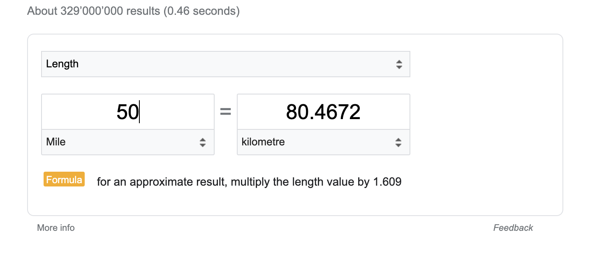

<p align="center">
  
</p>

# Specalizr

An implementation and platform agnostic, human-readable visual test scenario definition [DSL](./api).


## Project Goal :

Enable visual scenario ATDD in Java. Allow software producers and integrators to deliver E2E / front-end tests with
wireframes.

Streamline collaboration between all project stakeholders.

Example for a google unit conversion use case :

<p align="center">
  
</p>

``` java
        final var leftField = field(leftOf(item(with(text("=")))), below(selector(with(text("Length")))));
        final var rightField = field(rightOf(leftField));
        final var actions = first(click(item(with(text("I agree")))))
                .then(write("unit converter").into(field(above(button(with(text("Google Search")))))))
                .then(press(ENTER))
                .then(select("Mile").from(selector(with(text("Meter")))))
                .then(select("kilometre").from(selector(with(text("Centimeter")))))
                .then(clear(leftField))
                .then(write("50").into(leftField))
                .andLastly(validate(that(rightField), containsText("80.4672")));

        play(actions, with(seleniumPlayer));
```

## Concepts

### Action

A command to be performed on a given element (i.e. press, select, write, clear, ...)

### Element

Represents a visual component (i.e. button, select, checkbox, link, text ...)

### Query

Describes how to find an element (i.e. with(text("Length")) ... near(image(with(text(...)))))

### Player

A component that takes an Action chain and plays it against any given platform (web, mobile, desktop ...)

## Implementations

There is currently a [Selenium](./selenium) implementation available. 


